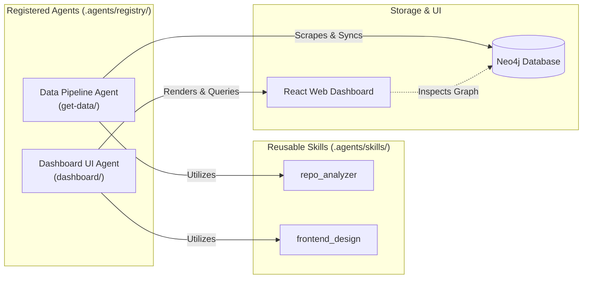

# System & Agent Architecture

This document synthesizes the system architecture, Neo4j graph database schema, registered agents, and orchestration workflows in the `knowledge-graph` repository.

## 1. Project Overview

The **Knowledge Graph** system automatically collects GitHub Trending repositories, stores and links data as a Knowledge Graph on Neo4j DB, and provides an interactive Web Dashboard for monitoring workflows.

## 2. System Architecture


## 3. Neo4j Graph Database Schema

Entities are stored as Nodes and linked via Relationships:

### Nodes
1. **`Repository`**:
   - `url` (String, Primary Key): GitHub URL.
   - `name` (String): Repo name (e.g. `facebook/react`).
   - `description` (String): Summary description.
   - `stars_total` (Integer): Total stars count.
2. **`Language`**:
   - `name` (String, Primary Key): Programming language name (e.g. `TypeScript`, `Python`).
3. **`TrendingPeriod`**:
   - `type` (String): Cycle type (`daily`, `weekly`, `monthly`).
   - `date` (String): Collection date (`YYYY-MM-DD`).

### Relationships
- **`(:Repository)-[:WRITTEN_IN]->(:Language)`**: Repo written in language.
- **`(:Repository)-[:TRENDING_IN {stars_added: N}]->(:TrendingPeriod)`**: Repo listed in trending period with `stars_added`.

## 4. Agent Architecture & Orchestration

The system partitions responsibilities across registered agents and modular skills:



### Agent & Skill Interaction
- **Data Pipeline Agent**: Handles scraping, transformation, and Neo4j database sync. Uses [`repo_analyzer`](skills/repo_analyzer/SKILL.md) to extract deep structured knowledge from repository READMEs.
- **Dashboard UI Agent**: Manages the React + Vite frontend application. Adheres to the design system defined in [`frontend_design`](skills/frontend_design/SKILL.md).

## 5. Directory Structure & Documentation Index

```text
knowledge-graph/
├── AGENTS.md                # [Source of Truth] Main entry point & instructions for AI agents
├── docker-compose.yml       # Neo4j container configuration (ports 7474, 7687)
├── data/                    # Volume storage for Neo4j
├── README.md                # Project overview & quickstart guide
│
├── .agents/                 # Memory & rules directory for AI agents
│   ├── ARCHITECTURE.md      # [Architecture] System & agent architecture (This file)
│   ├── rules/               # [Modular Rules] Testing, security, tech debt, code style
│   │   ├── testing.md
│   │   ├── security.md
│   │   ├── tech-debt.md
│   │   └── code-style.md
│   ├── registry/            # [Agent Catalog] Agent specifications
│   │   └── README.md
│   └── skills/              # [Skills] Reusable agent skills
│       ├── frontend_design/ # UI/UX design system guidelines
│       └── repo_analyzer/   # Repo analysis for Knowledge Graph ingestion
│
├── get-data/                # Backend Data Pipeline (Python) - Data Pipeline Agent scope
│   ├── github_trending.py   # GitHub trending scraper
│   ├── neo4j_sync.py        # Neo4j Cypher sync class
│   ├── test_github_trending.py # Unit tests
│   ├── requirements.txt     # Python dependencies
│   └── .env                 # Neo4j connection variables
│
└── dashboard/               # Frontend Web Application (React + Vite) - Dashboard UI Agent scope
    ├── src/
    │   ├── App.jsx          # Workflow canvas & inspector components
    │   └── index.css        # Dashboard CSS styling
    ├── package.json         # Dependencies
    └── vite.config.js       # Vite configuration
```

## 6. Data Pipeline Workflow

1. **Start Neo4j Database:** `docker-compose up -d`
2. **Run Pipeline (Data Pipeline Agent):** `python get-data/neo4j_sync.py [daily|weekly|monthly]`
3. **Run Dashboard (Dashboard UI Agent):** `cd dashboard && npm run dev`

## Reference Lookup Hierarchy

1. Start at [`AGENTS.md`](../AGENTS.md) for workflow entry point and non-negotiable rules summary.
2. Consult [`rules/`](rules/) for detailed testing, security, naming, and technical debt regulations.
3. Check [`registry/README.md`](registry/README.md) for agent roles and capabilities.
4. Refer to [`ARCHITECTURE.md`](ARCHITECTURE.md) (this file) for Neo4j graph schema and system flow.
