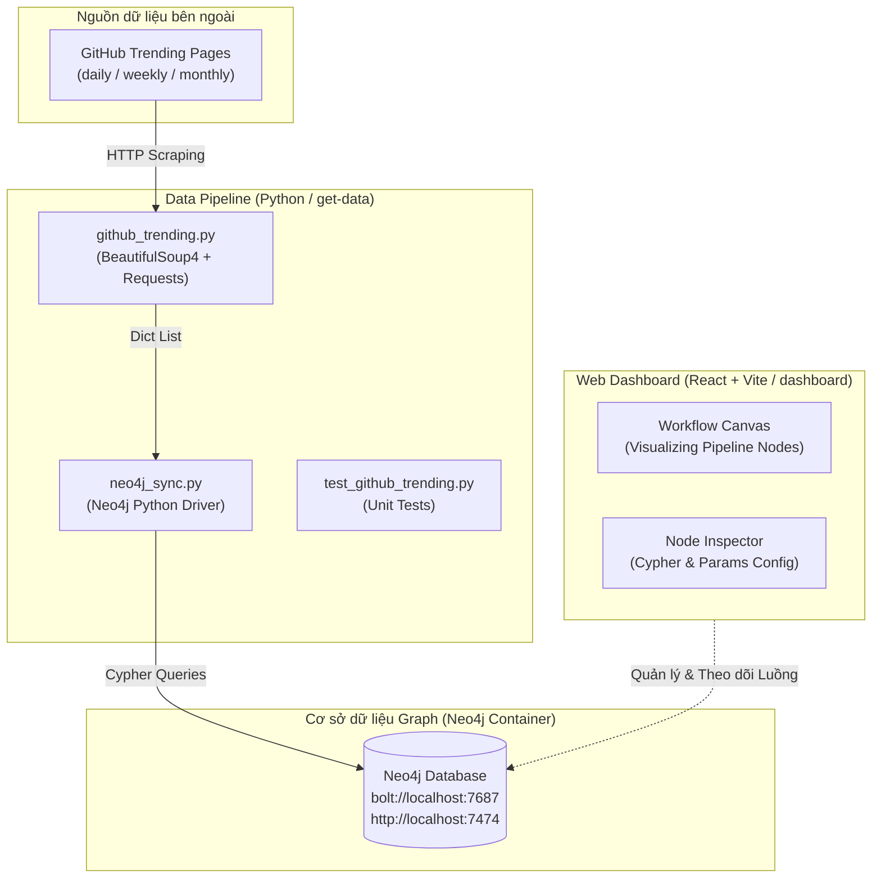

# Kiến trúc Dự án Knowledge Graph (Knowledge Graph Architecture) 🧠

> **Tài liệu tham chiếu dành cho AI Agent & Lập trình viên**  
> *Vị trí: `.agents/ARCHITECTURE.md`*  
> *Tài liệu này tổng hợp toàn bộ kiến trúc, luồng dữ liệu, schema cơ sở dữ liệu và cấu trúc dự án để giúp AI Agent nắm bắt dự án ngay lập tức ở các phiên làm việc tiếp theo.*

---

## 1. 🎯 Tổng quan Dự án

Hệ thống **Knowledge Graph** tự động thu thập thông tin các dự án nổi bật (GitHub Trending), lưu trữ và liên kết dữ liệu dưới dạng **Đồ thị Tri thức (Knowledge Graph)** trên CSDL **Neo4j**, đồng thời cung cấp giao diện **Web Dashboard** trực quan để theo dõi và điều phối các luồng công việc (Workflows).

---

## 2. 🏗 Kiến trúc Hệ thống (System Architecture)



---

## 3. 📊 Schema Cơ sở dữ liệu Neo4j (Graph Schema)

Hệ thống lưu trữ các đối tượng dưới dạng **Node** và liên kết bằng các **Relationship**:

### 🔷 Nút (Nodes)
1. **`Repository`**:
   - `url` (String, Primary Key): Đường dẫn GitHub của repo.
   - `name` (String): Tên repo (vd: `facebook/react`).
   - `description` (String): Mô tả repo.
   - `stars_total` (Integer): Tổng số sao tích lũy.
2. **`Language`**:
   - `name` (String, Primary Key): Tên ngôn ngữ lập trình (vd: `TypeScript`, `Python`).
3. **`TrendingPeriod`**:
   - `type` (String): Loại chu kỳ (`daily`, `weekly`, `monthly`).
   - `date` (String): Ngày thu thập dữ liệu (`YYYY-MM-DD`).

### 🔗 Mối quan hệ (Relationships)
- **`(:Repository)-[:WRITTEN_IN]->(:Language)`**: Repo được viết bằng ngôn ngữ tương ứng.
- **`(:Repository)-[:TRENDING_IN {stars_added: N}]->(:TrendingPeriod)`**: Repo lọt vào danh sách trending trong chu kỳ chỉ định với số sao tăng thêm `stars_added`.

---

## 4. 📂 Cấu trúc Thư mục & Vai trò Thành phần

```text
knowledge-graph/
├── docker-compose.yml       # Cấu hình container Neo4j (ports 7474, 7687)
├── data/                    # Volume dữ liệu lưu trữ Neo4j
├── README.md                # Tóm tắt nhanh & Hướng dẫn cài đặt ban đầu
│
├── .agents/                 # Thư mục quản lý bộ nhớ & quy tắc dành cho AI Agent
│   ├── AGENTS.md            # Quy tắc cốt lõi (Kiểm thử, bảo mật, quy ước code)
│   ├── ARCHITECTURE.md      # [File này] Chi tiết kiến trúc & schema dự án cho AI
│   └── skills/              # Kỹ năng mở rộng (Frontend design, UI guidelines, ...)
│
├── get-data/                # Backend Data Pipeline (Python)
│   ├── github_trending.py   # Hàm cào dữ liệu từ HTML GitHub Trending
│   ├── neo4j_sync.py        # Class TrendingGraph đồng bộ dữ liệu vào Neo4j qua Cypher
│   ├── test_github_trending.py # Test suite kiểm tra hàm cào dữ liệu
│   ├── requirements.txt     # Thư viện phụ thuộc (neo4j, beautifulsoup4, requests, python-dotenv)
│   └── .env                 # Biến môi trường kết nối Neo4j
│
└── dashboard/               # Frontend Web Application (React + Vite)
    ├── src/
    │   ├── App.jsx          # Giao diện chính: Workflow canvas & Node inspector
    │   └── index.css        # Styling cho UI Dashboard
    ├── package.json         # Dependencies
    └── vite.config.js       # Cấu hình Vite
```

*(Ghi chú: Thư mục `fe-example` là mã mẫu tham khảo độc lập, không nằm trong luồng vận hành chính).*

---

## 5. 🔄 Quy trình Xử lý Dữ liệu (Data Pipeline Workflow)

1. **Khởi chạy CSDL Neo4j:**
   - Sử dụng Docker Compose: `docker-compose up -d`.
   - Mật khẩu mặc định trong `docker-compose.yml`: `neo4j/khanh123456`.
2. **Cào dữ liệu & Đồng bộ:**
   - Chạy lệnh: `python get-data/neo4j_sync.py [daily|weekly|monthly]`
   - `github_trending.py` gửi request HTTP tới GitHub, parse HTML lấy danh sách repos.
   - `neo4j_sync.py` chạy các câu truy vấn Cypher để MERGE node và relationship.
3. **Giao diện Dashboard:**
   - Chạy dev server: `cd dashboard && npm run dev`.

---

## 📌 Hướng dẫn cho AI ở các phiên tiếp theo
Khi bắt đầu một phiên làm việc mới về dự án này:
1. Đọc nhanh file **`.agents/ARCHITECTURE.md`** và **`.agents/AGENTS.md`** để cập nhật toàn bộ ngữ cảnh hệ thống.
2. Kiểm tra `get-data/` khi cần làm việc với backend pipeline/Neo4j.
3. Kiểm tra `dashboard/` khi cần chỉnh sửa hoặc phát triển giao diện React.
